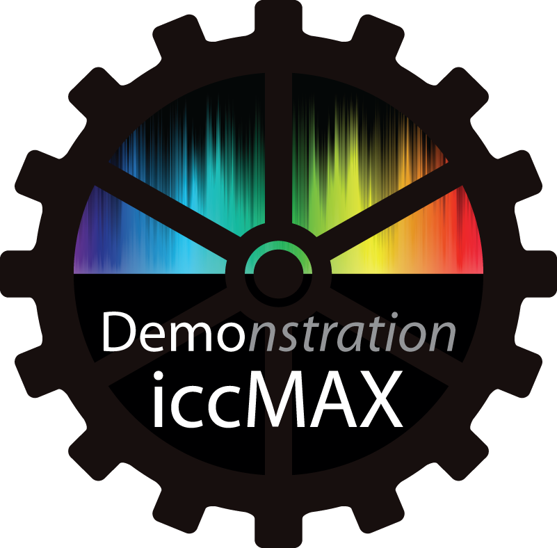

# DemoIccMAX
## Introduction

The DemoIccMAX project (formally known as RefIccMAX) provides an open
source set of libraries and tools that allow for the interaction,
manipulation, and application of iccMAX based color management profiles
based on the [iccMAX profile specification](http://www.color.org/iccmax.xalter)
in addition to legacy ICC profiles defined by [earlier ICC profile
specifications](http://www.color.org/icc_specs2.xalter).

iccMAX is not intended as a replacement for legacy ICC.1
based profiles, the existing architecture, but as an extension or alternative
where requirements cannot be fully met by ICC.1. Some of the areas covered by
iccMAX include: Multi-spectral, Medical Imaging, Image Capture/Digital
Photography, Package Printing, Color Management on Internet, Fine Art,
and Color Information Archiving. A more full description of
capabilities and functionality can be found on the ICC web site,
http://www.color.org/iccmax.xalter.

Note: The code in DemoIccMAX was initially based on the
[SampleICC](https://sourceforge.net/projects/sampleicc/) and
[IccXML](https://sourceforge.net/projects/iccxml/) open source projects, and
therefore concepts, files and data structures within DemoIccMAX may have
similarities (as well as various differences) to those in the SampleICC and
IccXML projects.

## Overview

Within the DemoIccMAX project are several libraries and tools as follows:

* Libraries that allow applications to interact with iccMAX profiles

  * IccProfLib - The DemoIccMAX IccProfLib project represents an open source &
    cross platform reference implementation of a C++ library for reading,
    writing, applying, manipulating iccMAX color profiles defined by the [iccMAX
    profile specification](http://www.color.org/iccmax.xalter). Class and object
    interaction documentation for IccProfLib can be found at ().

    * There are no intentional discrepancies between the DemoIccMAX
      implementation and the iccMAX specification. If any should occur then this
      should be brought to the attention of and resolved by the DemoIccMAX project
      team within the Architecture Working Group of the ICC organization.

      Though SampleICC provides a sample implementation, it does NOT
      represent a reference implementation of ICC.1 color management.

  * IccLibXML - The DemoIccMAX IccLibXML project contains a parallel C++
    extension library (IccLibXML) which provides the ability to interact with the
    objects defined by IccProfLib using an XML representation thus allowing iccMAX
    profiles to be expressed as or created from text based XML files. The
    IccLibXML project has a dependencies on the [libxml](http://www.xmlsoft.org/)
    project (which also has a dependency on iconv which must be separately
    installed on windows platforms).

* Tools based upon these libraries

  For command line arguments running the application without any arguments
  will display help information about command line options.

  * IccToXML is a cross platform command line tool that allows both legacy ICC
    and iccMAX profiles to be expressed using an XML representation. This allows
    for profiles to be converted to a textual representation that can be directly
    edited using a text editor and then converted back to ICC/iccMAX profile
    formats using IccFromXML.

    * This tool is dependent upon the IccLibXML project (above) as well as
      libXML and iconv.

  * IccFromXML is a cross platform command line tool that allows both legacy ICC
    and iccMAX profiles to be created from the same XML representation provided by
    IccToXML. A schema for iccXML files is forthcoming but can be determined using
    the FromXML() and ToXML() member functions defined in IccLibXML. The
    IccFromXML tool provides a simple direct method to create and manipulate
    iccMAX based profiles.

    * This tool is dependent upon the IccLibXML project (above) as well as
      libXML2 and iconv.

  * IccApplyNamedCmm is a cross platform command line tool that allows a
    sequence of legacy ICC and/or iccMAX profiles to be applied to colors defined
    in a text based input profile outputting the results to the console, and can
    be redirected to a output text file. Example source text files can be found in
    Testing/ApplyDataFiles. The IccApplyNamedCmm application provides a basis for
    testing various features of iccMAX.

  * IccApplyProfiles is a cross platform command line tool that allows a sequence of
    legacy and/or iccMAX profiles to a source TIFF image resulting in a destination
    TIFF image. The final destination profile can optionally be embedded in the
    resulting TIFF image.

    * This tool has a dependency on the [LibTIFF](http://www.libtiff.org/) project.

  * IccDumpProfile is a cross platform command line tool that allows information
    from a legacy ICC and or iccMAX profile to be output to the console. Data
    with non-printable values are replaced with '?'. Output from this tool is
    not guaranteed to be ASCII or UTF-8, but line-endings are consistent for a
    given platform.

    Detailed validation messages start with either "Warning!", "Error!" or "NonCompliant!".
    The overall status of validation is reported 2 lines below the line starting
    "Validation Report" and can be located using the following simple `grep`:

    ```bash
    grep --text -A 3 "^Validation Report" out.txt
    ```


  * IccRoundTrip is a cross platform command line tool that allows round trip
    colorimetric processing characteristics of rendering intent of a profile to be
    evaluated. (Evaluation goes from device values to PCS to establish initial PCS
    values. These are then converted to device values and then PCS values for the
    first round trip. Second round trip comparison then converts the second PCS
    values to device values to PCS values for comparison to the second PCS values.

  * IccSpecSepToTiff is a cross platform command line tool that combines separate
    individual TIFF images associated with different spectral wavelengths into a
    single multi-sample per pixel TIFF image. An iccMAX based profile can optionally
    be embedded in the resulting TIFF image.

    * This tool has a dependency on the [LibTIFF](http://www.libtiff.org/) project.

  * IccTiffDump is a cross platform command line tool that outputs header and
    embedded ICC profile information about a TIFF image to the console. This tool
    has a dependency on the LibTIFF project.

    * This tool has a dependency on the [LibTIFF](http://www.libtiff.org/) project.

  * RefIccLabsCMM provides a MacOS-X based Color Management Module that can be used
    within the ColorSync environment.

    * Many features of iccMAX based profiles are not accessible due to the
      limitation in support for only legacy ICC concepts within ColorSync.

  * wxProfileDump provides a [wxWidgets](https://www.wxwidgets.org/) GUI based
    iccMAX and legacy ICC profile inspector tool. The code for this tool is based on
    wxWidgets 2.x, and is therefore dependent on this version of wxWidgets. At
    present only Windows based testing has been performed on this (though wxWidgets
    is a cross-platform development environment).

    A development effort to port this tool to the cross-platform QT development
    environment is *greatly needed*.

## Example iccMAX Profiles

XML files are provided that can be used to create example iccMAX profiles. The
CreateAllProfiles.bat file uses the iccFromXML tool to create ICC profiles for
each of these XML files. The XML files can be found in the following folders:

### [Calc](Testing/Calc)

This folder contains profiles that demonstrate color modeling using the
Calculator MultiProcessElement. The srgbCalcTest profile exercises all specified
calculator operations.

### [Display](Testing/Display)

This folder contains profiles that demonstrate spectral modeling of display
profiles allowing for late binding of the observer using MultiProcessElements
that are transformed at startup to colorimetry for the desired observer.

### [Encoding](Testing/Encoding)

This folder contains 3 channel encoding class profiles. Both "name only"
profiles as well as fully specified profiles are present.

### [Named](Testing/Named)

This folder contains named color profiles showcasing
features such as tints, spectral reflectance, and fluorescence (with and with
out sparse notation).

### [PCC](Testing/PCC)

This folder contains various profiles that can be used to
define Profile Connection Conditions (PCC). All profiles are abstract profiles
that perform no operation to PCS values. However, all profiles contain fully
defined PCC tags that provide information that can be used to define rendering
for various observers and illuminants. Profiles that utilize both absolute
colorimetry as well as Material Adjusted colorimetry are present.

### [SpecRef](Testing/SpaceRef)

This folder contains various profiles that convert data to/from/between a
spectral reflectance PCS. The argbRef (AdobeRGB) and srgbRef (sRGB) convert RGB
values to/from spectral reflectance. RefDecC, RefDecH, and RefIncW are abstract
spectral reflectance profiles that modify "chroma", "hue", and "lightness" of
spectral reflectance values in a spectral reflectance PCS. The argbRef, srgbRef,
RefDecC, RefDecH, RefIncW profiles all estimate and/or manipulate spectral
reflectance using Wpt based spectral estimation (see chapter 7 of
http://scholarworks.rit.edu/theses/8789/. Additionally, examples of 6 channel
abridged spectral encoding is provided.

## Project Build Considerations

### Dependencies
* [libxml2](http://xmlsoft.org/) - for IccXML2 library and tools
* [libtiff](http://www.libtiff.org/) - for Tiff image tools
* [wxWidgets](https://www.wxwidgets.org/) - for basic profile viewer GUI

### Windows

The project solution files `BuildAll.sln` for various versions
of the Microsoft Visual Studio development IDE can
be found in the [./Build/MSVC](Build/Build/MSVC) folder.
This references additional `.vcproj` files
for the various libraries and applications provided by DemoIccMAX. Projects
without any further dependencies should build and link correctly. Both 32 and
64 bit compile options are supported. Some of the projects have further
dependencies on third party libraries requiring that the SDK libraries are
installed, and some system environment variables need to be set to correctly
reference the include files and libraries. (Note: Projects with additional
dependencies may not correctly build if these libraries and environment variable
are not set up before running Visual Studio).

The dependency on libxml2 and iconv by the IccLibXML library as well as the
IccToXML and IccFromXML applications requires that these SDKs are accessible, and are
referenced using the system environment variable `VendorTreeDir` with various
sub-directories beneath.
Macros for the location of each of these third party libraries is defined in
`[BuildDefs.props](Build/MSVC/BuildDefs.props)`.
64-bit versions of these SDKs can be found on the
[gnome website](http://ftp.gnome.org/pub/GNOME/binaries/win64/dependencies/).

For example:

```bash
ICONV=C:\DevLibs\iconv\iconv-.9.2
LIBXML2=C:\DevLibs\libxml2\libxml2-2.7.8
```

The dependency on libtiff by the IccApplyProfiles, IccSpecSepToTiff, and
IccTiffDump tools requires that the libtiff SDK is accessible, and is referenced
using the system environment variables `LIBTIFF_DLIB` (debug library to use),
`LIBTIFF_INCLUDE`, `LIBTIFF_LIB` (release library to use), and `LIBTIFF_LIBDIR`.

For example:

```bash
LIBTIFF_DLIB=libtiff.lib
LIBTIFF_INCLUDE=C:\DevLibs\libtiff\tiff-4.0.3\libtiff
LIBTIFF_LIB=libtiff.lib
LIBTIFF_LIBDIR=C:\DevLibs\libtiff\tiff-4.0.3\libtiff
```

The dependency on wxWidgets by the wxProfileDump tool requires that the
wxWidgets SDK is accessible, and is reference using the system environment
variables `WXWIN` and `WXVER`.

For example:

```bash
WXWIN=C:\DevLibs\WXWidgets\wxWidgets-2.8.11
WXVER=28
```

When the `ICC_USE_EIGEN_SOLVER` is defined in
[IccProfLibConf.h](IccProfLib/IccProfLibConf.h) then the Calc element solv
operator will be implemented using the Eigen math C++ template library,
http://eigen.tuxfamily.org/index.php?title=Main_Page. It must be referenced
using the system environment variable `EIGEN`.

For example:

```bash
EIGEN=C:\DevLibs\eigen\eigen-3.2.8
```

### MacOS-X

XCODE projects can be found in each of the library and project folders that are
presently supported for building on the MacOS-X platform. The file
Build/XCode/BuildAll.sh contains a bash Terminal script that can be used to
build all of the XCODE projects.

Header files and binaries for the libtiff and libxml libraries need to be
manually installed before the BuildAll.sh script is executed. The libtiff header
files need to be placed in the Build/XCode/libtiff folder (specified by the
LibTifSetup.txt file in this folder). The libxml header files need to be placed
in the Build/XCode/libxml folder (specified by the LibXmlSetup.txt file in this
folder). (Note: Projects with additional dependencies may not correctly build if
these folders not set up before running the BuildAll.sh script).

The BuildAll.sh script file will make a copy of the libIccProfLib.a and
libIccXML.a library binaries into the Build/XCode/lib folder. The libraries in
Build/XCode/lib are then referenced by the rest of the projects in DemoIccMAX.
Executables for the various tools will be placed into the Testing folder after a
successful run of `BuildAll.sh`.

### CMake

[Cmake](https://cmake.org/) builds should work cross platform. The source
archive contains a CMake build configuration, which can be used to build on the
command line with make or ninja, or generate a project for a KDevelop or Eclipse
or for the platform specific XCode and VC++ IDEs.

Note: for historic reasons, the CMake system still uses the name "RefIccMAX"

#### Compilation

Typical create a out of source build directory and specify an install path:

```bash
mkdir build && cd build
cmake -DCMAKE_BUILD_TYPE=Debug -DCMAKE_INSTALL_PREFIX=$HOME/.local ../Build/Cmake
make help
make
make install
```

##### Build Flags

Use `-DCMAKE_BUILD_TYPE=Debug`, `-DCMAKE_BUILD_TYPE=Release` or one of the other
CMake build types.

Typical cmake flags like `CMAKE_CXX_FLAGS` can be used to tune compilation. For
development `... -DCMAKE_CXX_FLAGS="-Wextra -Wimplicit-fallthrough=0 -g"` is
recommended, but this will **not be warning free!**.

Note: `-Wimplicit-fallthrough=0` disables case fall-through warnings on switch
statements as this is actively used (e.g. in IccConvertUTF.cpp). There will also
be many `-Wsign-compare` warnings and a few `-Wenum-compare` and
`-Wdeprecated-copy` warnings.

* `ENABLE_TESTS` - default is ON
* `ENABLE_TOOLS` - default is ON
* `ENABLE_SHARED_LIBS` - default is ON
* `ENABLE_STATIC_LIBS` - default is ON
* `ENABLE_INSTALL_RIM` - install no files if build as subproject
* `USE_SYSTEM_LIBXML2` - default is OFF


### Linux Packages

* Pre Release Binaries - Open Build Service [OBS](https://software.opensuse.org//download.html?project=home%3Abekun%3Adevel&package=libDemoIccMAX-devel)

### Linux Issues and Solutions

You may also need to set `LD_LIBRARY_PATH` to `CMAKE_INSTALLPREFIX`/lib so that
`libIccProfLib2.so` and `libIccXML.so` shared libraries can be located at runtime.

Depending on the Host:
```bash
export LD_LIBRARY_PATH=$HOME/.local/lib:$LD_LIBRARY_PATH
```
or
```bash
export LD_LIBRARY_PATH=$HOME/.local/lib64:$LD_LIBRARY_PATH
```

When running `iccDumpProfileGui` under X-Windows the following error messages
may be seen on the console:

`libGL error: No matching fbConfigs or visuals` This can be fixed with:

```bash
export LIBGL_ALWAYS_INDIRECT=1
```

`libGL error: failed to load driver: swrast` This can be fixed with:

```bash
sudo apt-get install -y mesa-utils libgl1-mesa-glx
```

```
/usr/local/lib/libgnutls.so.30: version `GNUTLS_3_6_3' not found (required by /usr/lib/x86_64-linux-gnu/gio/modules/libgiognutls.so)
Failed to load module: /usr/lib/x86_64-linux-gnu/gio/modules/libgiognutls.so
```
The above error messages appear to be harmless, but running
`apt-cache policy libgnutls30` or `gntls-cli -v` will likely indicate a
different (later) version of gnutls.

## License

[The ICC Software License](LICENSE.md)
