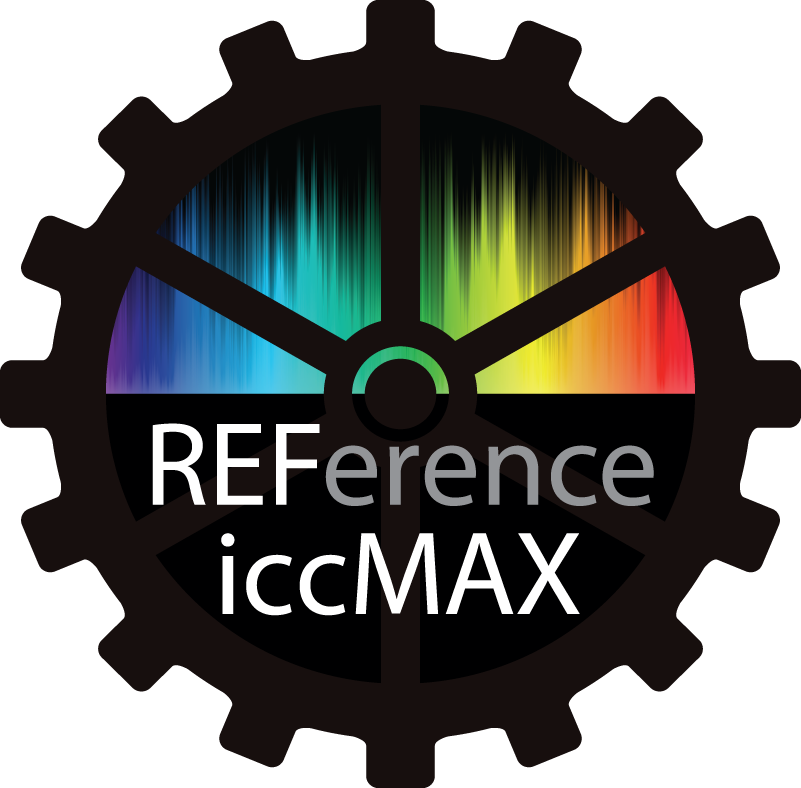

<h1 style="text-align: center;"> </h1><h1 style="text-align: center;">RefIccMAX</h1><h2>Introduction</h2>

The RefIccMAX project provides an open source set of
libraries and tools that allow for the interaction, manipulation, and
application of iccMAX based color management profiles based on the iccMAX
profile specification (<a href="http://www.color.org/iccmax.xalter">http://www.color.org/iccmax.xalter</a>)
in addition to legacy ICC profiles defined by earlier ICC profile
specifications (<a href="http://www.color.org/icc_specs2.xalter">http://www.color.org/icc_specs2.xalter</a>).

iccMAX is not intended as a replacement for legacy ICC.1
based profiles, the existing architecture, but as an extension or alternative
where requirements cannot be fully met by ICC.1.&nbsp; Some of the areas covered by iccMAX include:
Multi-spectral, Medical Imaging, Image Capture/Digital Photography, Package
Printing, Color Management on Internet, Fine Art, and Color Information
Archiving. &nbsp;A more fuller description of
capabilities and functionality can be found on the ICC web site (<a href="http://www.color.org/iccmax.xalter">http://www.color.org/iccmax.xalter</a>).

Note: The code in RefIccMAX was initially based on the
SampleICC (<a href="https://sourceforge.net/projects/sampleicc/">https://sourceforge.net/projects/sampleicc/</a>)
and IccXML (<a href="https://sourceforge.net/projects/iccxml/">https://sourceforge.net/projects/iccxml/</a>)
open source projects, and therefore concepts, files and data structures within
RefIccMAX&nbsp; may have similarities (as well
as various differences) to those in the SampleICC and IccXML projects. 

<h2>Overview</h2>

Within the RefIccMAX project are several libraries and tools
as follows:

<!--[if !supportLists]-->·&nbsp;&nbsp;&nbsp;&nbsp;&nbsp;&nbsp;&nbsp;&nbsp;
<!--[endif]-->Libraries that allow applications to interact
with iccMAX profiles

<!--[if !supportLists]-->o&nbsp;&nbsp;
<!--[endif]-->IccProfLib &#8211; The RefIccMAX IccProfLib project
represents an open source / cross platform &#8220;reference implementation&#8221; of a C++
library for reading/writing/applying/manipulating iccMAX color profiles defined
by the iccMAX profile specification (<a href="http://www.color.org/iccmax.xalter">http://www.color.org/iccmax.xalter</a>).&nbsp; Class and object interaction documentation
for IccProfLib can be found at ().

<!--[if !supportLists]-->§&nbsp;
<!--[endif]-->Note 1: There are no intentional discrepancies
between the RefIccMAX implementation and the iccMAX specification.&nbsp; If any should occur then this should be
brought to the attention of and resolved by the RefIccMAX project team within
the Architecture Working Group of the ICC organization. 

<!--[if !supportLists]-->§&nbsp;
<!--[endif]-->Note 2: Though SampleICC provides a sample
implementation, it does NOT represent a &#8220;reference implementation&#8221; of ICC.1 color management.&nbsp; 

<!--[if !supportLists]-->o&nbsp;&nbsp;
<!--[endif]-->IccLibXML &#8211; The RefIccMax IccLibXML project
contains a parallel C++ extension library (IccLibXML) which provides the
ability to interact with the objects defined by IccProfLib using an XML
representation thus allowing iccMAX profiles to be expressed as or created from
text based XML files.&nbsp; The IccLibXML
project has a dependencies on the libxml&nbsp;
(<a href="http://www.xmlsoft.org/">http://www.xmlsoft.org/</a>) project
(which also has a dependency on iconv&nbsp;which must be separately installed
under windows platforms).&nbsp; 

<!--[if !supportLists]-->·&nbsp;&nbsp;&nbsp;&nbsp;&nbsp;&nbsp;&nbsp;&nbsp;
<!--[endif]-->Tools based upon these libraries that allow for
iccMAX profiles to be investigated, created, manipulated, and applied.&nbsp; For command line arguments running the
application without any arguments will display help information about command
line options.

<!--[if !supportLists]-->o&nbsp;&nbsp;
<!--[endif]-->IccToXML is a cross platform command line tool
that allows both legacy ICC and iccMAX profiles to be expressed using an XML
representation.&nbsp; This allows for profiles
to be converted to a textual representation that can be directly edited using a
text editor and then converted back to ICC/iccMAX profile formats using
IccFromXML. 

<!--[if !supportLists]-->§&nbsp;
<!--[endif]-->This tool is dependent upon the IccLibXML
project as well as libXML and iconv.

<!--[if !supportLists]-->o&nbsp;&nbsp;
<!--[endif]-->IccFromXML is a cross platform command line tool
that allows both legacy ICC and iccMAX profiles to be created from the same XML
representation provided by IccToXML.&nbsp; A
schema for iccXML files is forthcoming but can be determined using the
FromXML() and ToXML() member functions defined in IccLibXML.&nbsp; The IccFromXML tool provides a simple direct
method to create and manipulate iccMAX based profiles.&nbsp; 

<!--[if !supportLists]-->§&nbsp;
<!--[endif]-->This tool is dependent upon the IccLibXML
project as well as libXML and iconv.

<!--[if !supportLists]-->o&nbsp;&nbsp;
<!--[endif]-->IccApplyNamedCmm is a cross platform command
line tool that allows a sequence of legacy ICC and/or iccMAX profiles to be applied
to colors defined in a text based input profile outputting the results to the
console, and can be redirected to a output text file.&nbsp; Example source text files can be found in
Testing/ApplyDataFiles.&nbsp; The
IccApplyNamedCmm application provides a basis for testing various features of
iccMAX.

<!--[if !supportLists]-->o&nbsp;&nbsp;
<!--[endif]-->IccApplyProfiles is a cross platform command
line tool that allows a sequence of legacy and/or iccMAX profiles to a source
TIFF image resulting in a destination TIFF image.&nbsp; The final destination profile can optionally
be embedded in the resulting TIFF image.

<!--[if !supportLists]-->§&nbsp;
<!--[endif]-->This tool has a dependency on the LibTIFF (<a href="http://www.libtiff.org/">http://www.libtiff.org/</a>) project.

<!--[if !supportLists]-->o&nbsp;&nbsp;
<!--[endif]-->IccDumpProfile is a cross platform command line
tool that allows information from a legacy ICC and or iccMAX profile to be
output to the console. 

<!--[if !supportLists]-->o&nbsp;&nbsp;
<!--[endif]-->IccRoundTrip is a cross platform command line
tool that allows round trip colorimetric processing characteristics of
rendering intent of a profile to be evaluated.&nbsp;
(Evaluation goes from device values to PCS to establish intial PCS
values.&nbsp; These are then coverted to
device values and then PCS values for the first round trip.&nbsp; Second round trip comparison then converts
the second PCS values to device values to PCS values for campison to the second
PCS values.

<!--[if !supportLists]-->o&nbsp;&nbsp;
<!--[endif]-->IccSpecSepToTiff is a cross platform command
line tool that combines separate individual TIFF images associated with
different spectral wavelengths into a single multi-sample per pixel TIFF
image.&nbsp; An iccMAX based profile can
optionally be embedded in the resulting TIFF image.&nbsp; 

<!--[if !supportLists]-->§&nbsp;
<!--[endif]-->This tool has a dependency on the LibTIFF (<a href="http://www.libtiff.org/">http://www.libtiff.org/</a>) project.

<!--[if !supportLists]-->o&nbsp;&nbsp;
<!--[endif]-->IccTiffDump is a cross platform command line
tool that outputs header and embedded ICC profile information about a TIFF
image to the console.&nbsp; This tool has a
dependency on the LibTIFF project.

<!--[if !supportLists]-->§&nbsp;
<!--[endif]-->This tool has a dependency on the LibTIFF (<a href="http://www.libtiff.org/">http://www.libtiff.org/</a>) project.

<!--[if !supportLists]-->o&nbsp;&nbsp;
<!--[endif]-->RefIccLabsCMM provides a MacOS-X based Color
Management Module that can be used within the ColorSync environment.&nbsp; 

<!--[if !supportLists]-->§&nbsp;
<!--[endif]-->Note: Many features of iccMAX based profiles are
not accessable due to the limitation in support for only legacy ICC concepts
within ColorSync.

<!--[if !supportLists]-->o&nbsp;&nbsp;
<!--[endif]-->wxProfileDump provies a wxWidgets based (<a href="https://www.wxwidgets.org/">https://www.wxwidgets.org/</a>) GUI based
legacy ICC and iccMAX profile inspector tool.&nbsp;
The code for this tool is based on wxWidgets 2.x, and is therefore
dependent on this version of wxWidgets.&nbsp;
At present only Windows based testing has been performed on this
(though wxWidgets is a cross-platform development environment).&nbsp; A development effort to port this tool to the
cross-platform QT development environment is greatly needed.

<h2>Example iccMAX Profiles</h2>

XML files are provided that can be used to create example iccMAX
profiles. &nbsp;The CreateAllProfiles.bat file
uses the iccFromXML tool to create ICC profiles for eache of these XML files.&nbsp; The XML files can be found in the following
folders: 

<h3>Calc</h3>

This folder contains profiles that demonstrate color modeling
using the Calculator MultiProcessElement.&nbsp;
The srgbCalcTest profile exercises all specified calculator operations.

<h3>Display</h3>

This folder contains profiles that demonstrate spectral
modeling of display profiles allowing for late binding of the observer using
MultiProcessElements that are transformed at startup to colorimetry for the
desired observer.

<h3>Encoding</h3>

This folder contains 3 channel encoding class profiles.&nbsp; Both "name only" profiles as well
as fully specified profiles are present.

<h3>Named</h3>

This folder contains named color profiles showcasing
features such as tints, spectral reflectance, and fluorescence (with and with
out sparse notation).

<h3>PCC</h3>

This folder contains various profiles that can be used to
define Profile Connection Conditions (PCC).&nbsp;
All profiles are abstract profiles that&nbsp;
perform no operation to PCS values.&nbsp;
However, all profiles contain fully defined PCC tags that provide
information that can be used to define rendering for various observers and
illuminants.&nbsp; Profiles that utilize both
absolute colorimetry as well as Material Adjusted colorimetry are present.

<h3>SpecRef</h3>

This folder contains various profiles that convert data to/from/betweteen a spectral reflectance PCS.&nbsp; The
argbRef (AdobeRGB) and srgbRef (sRGB) convert
RGB values to/from spectral reflectance. &nbsp;RefDecC, RefDecH, and
RefIncW are abstract spectral reflectance profiles that modify
"chroma", "hue", and "lightness" of spectral reflectance values in a
spectral reflectance PCS. &nbsp;The argbRef, srgbRef, RefDecC, RefDecH,
RefIncW profiles all estimate and/or manipulate spectral reflectance
using&nbsp;Wpt based spectral estimation
(see chapter 7 of <a href="http://scholarworks.rit.edu/theses/8789/">http://scholarworks.rit.edu/theses/8789/</a> ).&nbsp; Additionally, examples of 6 channel abridged spectral
encoding is provided.

<h2>Project Build Considerations</h2>

<h3>Windows</h3>

The project solution BuildAll.sln file for the Visual Studio
development IDE can be found in the ./Build/MSVC folder.&nbsp; This references additional .vcproj files for
the various libraries and applications provided by RefIccMAX.&nbsp; Projects without any further dependencies
should build and link correctly.&nbsp; Both 32
and 64bit compile options are supported.&nbsp;&nbsp;&nbsp;
Some of the projects have further dependencies on third party libraries
requiring that the SDK libraries are installed, and some system environment
variables need to be set to correctly reference the include files and
libraries.&nbsp; (Note: Projects with
additional dependencies may not correctly build if these libraries and
environment variable are not set up before running Visual Studio).

The dependency on libxml2 and iconv by the IccLibXML library
as well as the IccToXML and IccFromXML applications requires these SDK&#8217;s are
accessible, and are referenced using the system environment variables LIBXML
and ICONV.&nbsp;&nbsp; 64-bit versions of these
SDK&#8217;s can be found on the gnome website (<a href="http://ftp.gnome.org/pub/GNOME/binaries/win64/dependencies/">http://ftp.gnome.org/pub/GNOME/binaries/win64/dependencies/</a>).
For example:

ICONV=C:\DevLibs\iconv\iconv-1.9.2

LIBXML2=C:\DevLibs\libxml2\libxml2-2.7.8

The dependency on libtiff by the IccApplyProfiles,
IccSpecSepToTiff, and IccTiffDump tools requires that the libtiff SDK is
accessible, and is referenced using the system environment variables
LIBTIFF_DLIB (debug library to use), LIBTIFF_INCLUDE, LIBTIFF_LIB (release
library to use), and LIBTIFF_LIBDIR.&nbsp; For
example:

LIBTIFF_DLIB=libtiff.lib

LIBTIFF_INCLUDE=C:\DevLibs\libtiff\tiff-4.0.3\libtiff

LIBTIFF_LIB=libtiff.lib

LIBTIFF_LIBDIR=C:\DevLibs\libtiff\tiff-4.0.3\libtiff

The dependency on wxWidgets by the wxProfileDump tool
requires that the wxWidgets SDK is accessible,&nbsp;
and is reference using the system environment variables WXWIN and WXVER.
For example:

WXWIN=C:\DevLibs\WXWidgets\wxWidgets-2.8.11

WXVER=28

When the
ICC_USE_EIGEN_SOLVER is defined in IccProfLibConf.h then the Calc
element solv operator will be implementd using the Eigen math C++
template library (<a href="http://eigen.tuxfamily.org/index.php?title=Main_Page">http://eigen.tuxfamily.org/index.php?title=Main_Page</a>), and is referenced using the system environeent variable EIGEN. &nbsp;Fore example:
EIGEN=C:\DevLibs\eigen\eigen-3.2.8<h3>MacOS-X</h3>

XCODE projects can be found in each of the library
and project folders that are presently supported for building on the
MacOS-X platform. The file Build/XCode/BuildAll.sh contains a bash Terminal script that can be used to build all of the XCODE projects. &nbsp;

Header
files and&nbsp;binaries for the libtiff and libxml libraries&nbsp;need
to be manually installed before the BuildAll.sh script is executed.
&nbsp;The libtiff header files need to be placed in the
Build/XCode/libtiff folder (specified by the LibTifSetup.txt file in
this folder). &nbsp;The libxml header files need to be placed in the
Build/XCode/libxml folder (specified by the LibXmlSetup.txt file in
this folder). &nbsp;(Note: Projects with
additional dependencies may not correctly build if these folders not set up before running the BuildAll.sh script).

The
BuildAll.sh script file will make a copy of the libIccProfLib.a and
libIccXML.a library binaries into the Build/XCode/lib folder. &nbsp;The
libraries in Build/XCode/Lib are then referenced by the rest of the
projects in RefIccMAX. &nbsp;Executables for the various tools will be
placed into the Testing folder after a successful run
of&nbsp;BuildAll.sh.

<h3>Linux</h3>

TBD

<h2>License</h2>
The ICC Software License, Version 0.2   Copyright (c) 2003-2015 The International Color Consortium. All rights  reserved.  Redistribution and use in source and binary forms, with or without modification, are permitted provided that the following conditions are met:  1. Redistributions of source code must retain the above copyright &nbsp;&nbsp; notice, this list of conditions and the following disclaimer.   2. Redistributions in binary form must reproduce the above copyright &nbsp;&nbsp; notice, this list of conditions and the following disclaimer in &nbsp;&nbsp; the documentation and/or other materials provided with the &nbsp;&nbsp; distribution.  3. In the absence of prior written permission, the names "ICC" and "The &nbsp;&nbsp; International Color Consortium" must not be used to imply that the &nbsp;&nbsp; ICC organization endorses or promotes products derived from this &nbsp;&nbsp; software.  THIS SOFTWARE IS PROVIDED ``AS IS'' AND ANY EXPRESSED OR IMPLIED WARRANTIES, INCLUDING, BUT NOT LIMITED TO, THE IMPLIED WARRANTIES OF MERCHANTABILITY AND FITNESS FOR A PARTICULAR PURPOSE ARE DISCLAIMED.&nbsp; IN NO EVENT SHALL THE INTERNATIONAL COLOR CONSORTIUM OR ITS CONTRIBUTING MEMBERS BE LIABLE FOR ANY DIRECT, INDIRECT, INCIDENTAL, SPECIAL, EXEMPLARY, OR CONSEQUENTIAL DAMAGES (INCLUDING, BUT NOT LIMITED TO, PROCUREMENT OF SUBSTITUTE GOODS OR SERVICES; LOSS OF USE, DATA, OR PROFITS; OR BUSINESS INTERRUPTION) HOWEVER CAUSED AND ON ANY THEORY OF LIABILITY, WHETHER IN CONTRACT, STRICT LIABILITY, OR TORT (INCLUDING NEGLIGENCE OR OTHERWISE) ARISING IN ANY WAY OUT OF THE USE OF THIS SOFTWARE, EVEN IF ADVISED OF THE POSSIBILITY OF SUCH DAMAGE. ====================================================================  This software consists of voluntary contributions made by many individuals on behalf of the The International Color Consortium.    Membership in the ICC is encouraged when this software is used for commercial purposes.   &nbsp;  For more information on The International Color Consortium, please see <a href="http://www.color.org/">http://www.color.org/</a>. 
